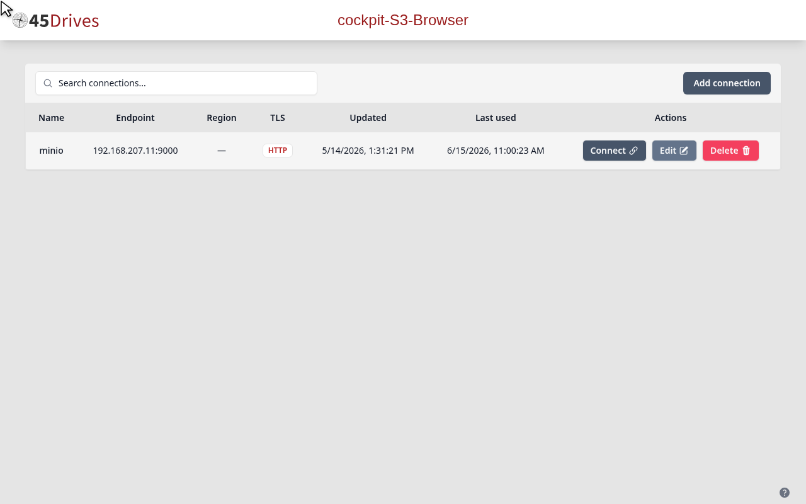
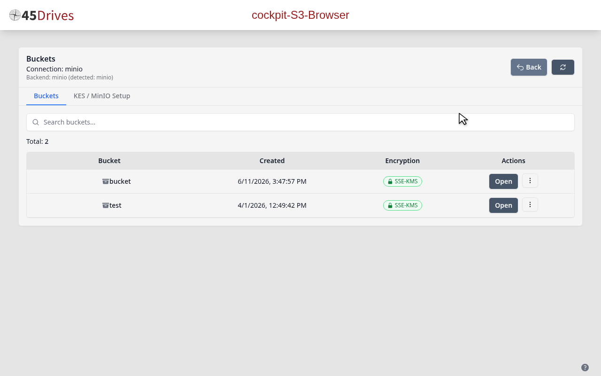
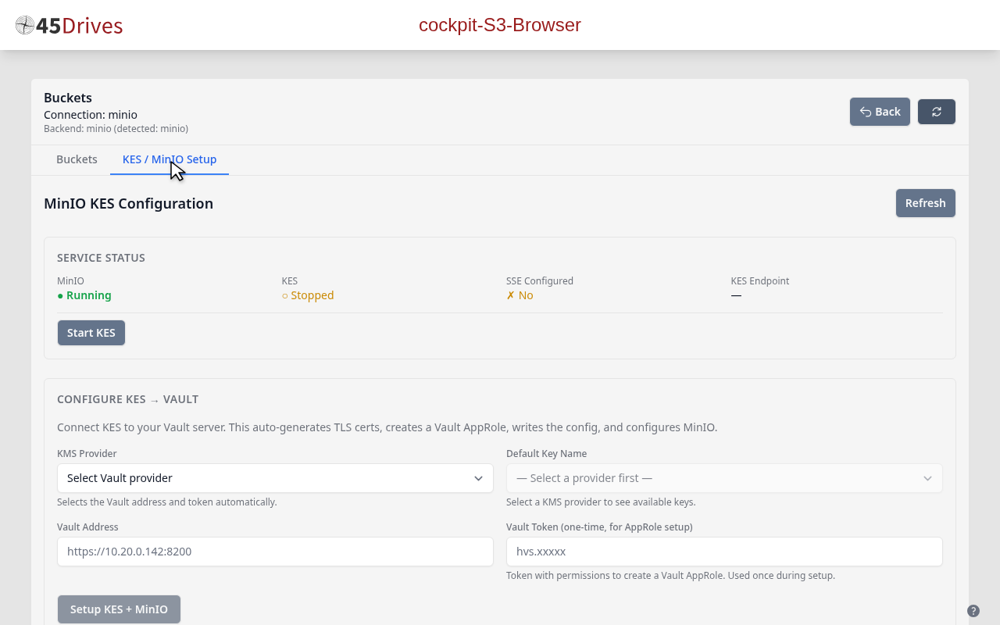
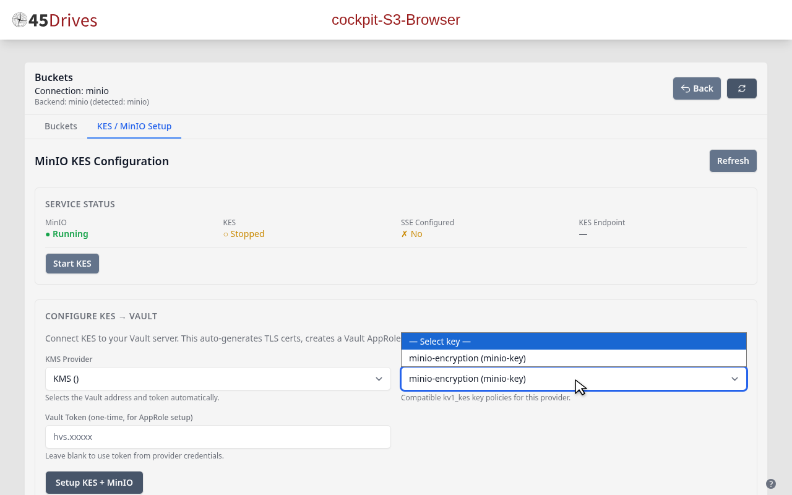
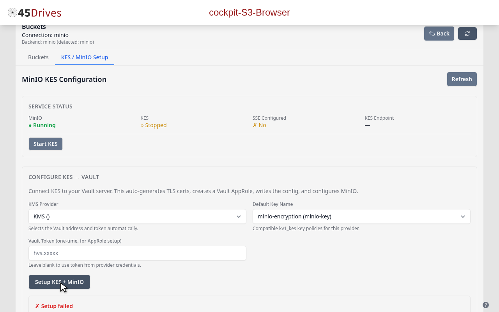
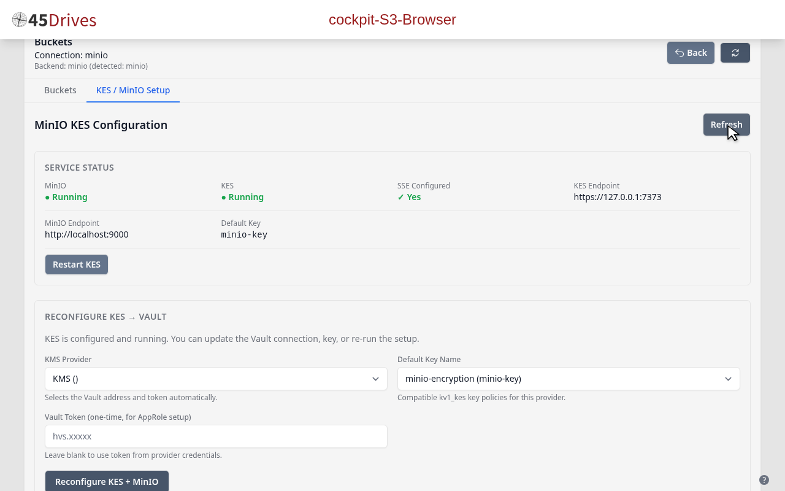
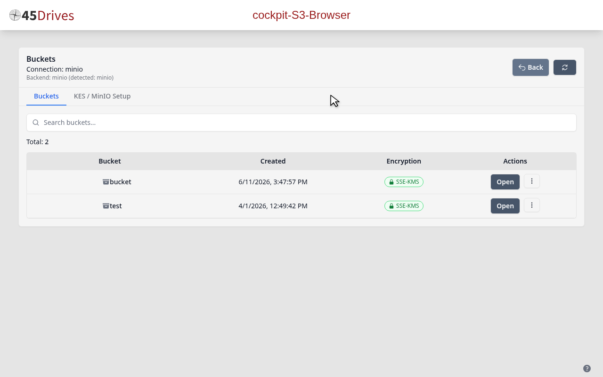
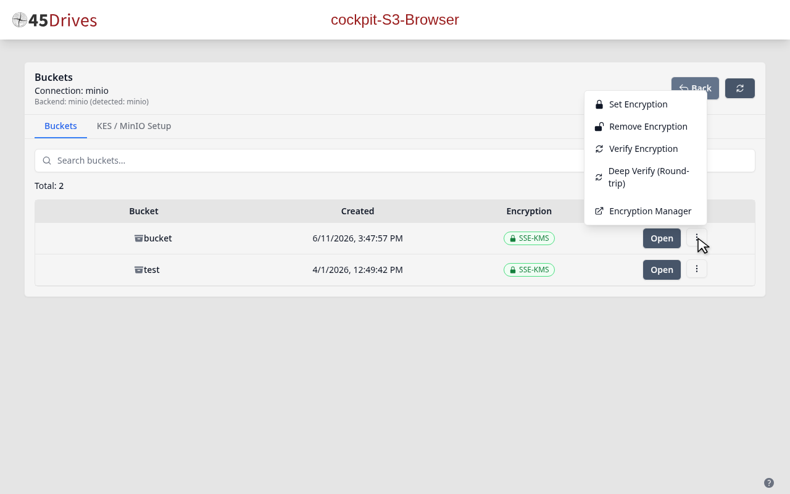
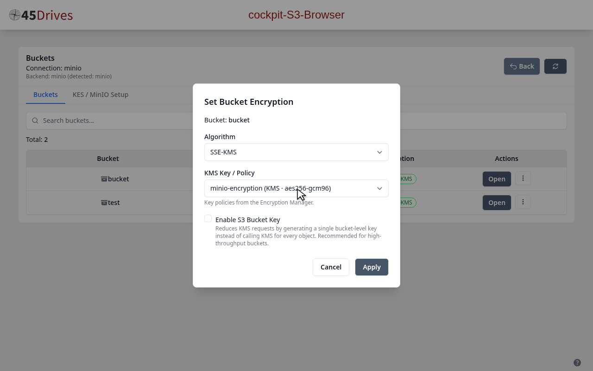
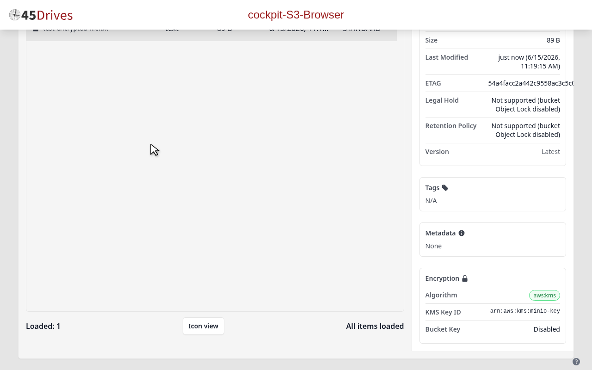

# MinIO KES Encryption Setup Guide

This guide walks you through configuring MinIO Key Encryption Service (KES) with HashiCorp Vault using the Houston S3 Browser Cockpit plugin. The entire process is automated through the web interface.

## Video Walkthrough

A narrated video walkthrough is available: [minio-kes-guide.mp4](minio-kes-guide.mp4)

---

## Prerequisites

- MinIO server configured and accessible
- HashiCorp Vault server running with a KMS provider configured in the Control Plane
- Cockpit with the Houston S3 Browser plugin installed

---

## 1. Connect to MinIO

Open Cockpit and navigate to the **S3 Browser** plugin. On the Connections page, locate your MinIO endpoint and click **Connect**.

---

## 2. View Buckets

After connecting, the **Buckets** tab displays your storage buckets. Notice the **KES / MinIO Setup** tab in the navigation — this tab only appears for MinIO-backed connections.

---

## 3. Check KES Status (Unconfigured)

Click the **KES / MinIO Setup** tab. The Service Status panel shows:
- **MinIO**: Running
- **KES**: Stopped
- **SSE**: Not configured

Below the status is the **Configure KES to Vault** section.

---

## 4. Configure KES

1. **Select KMS Provider** from the dropdown — this automatically provides the Vault address and token (no manual token entry required)
2. **Select Key Policy** from the second dropdown (e.g., `minio`)

The Vault Token field remains visible but is optional when a provider is selected — the provider supplies credentials automatically via AppRole.

---

## 5. Run Setup

Click **Setup KES + MinIO** to start the automated configuration. The wizard:
1. Generates TLS certificates for KES
2. Creates a MinIO identity in Vault
3. Writes the KES configuration file
4. Starts the KES service
5. Configures MinIO environment variables
6. Restarts MinIO

All steps complete with green checkmarks.

---

## 6. Verify Configured Status

After setup completes, the Service Status panel shows everything healthy:
- **MinIO**: Running
- **KES**: Running
- **SSE**: Configured (endpoint `127.0.0.1:7373`, default key active)

---

## 7. Enable Bucket Encryption

Switch to the **Buckets** tab. With KES configured, you can now enable server-side encryption on individual buckets.

Click the three-dot menu (⋮) on a bucket row to open the context menu.

Select **Set Encryption** to open the encryption configuration modal:
- **Algorithm**: Choose `aws:kms` (SSE-KMS) for Vault-backed encryption
- **KMS Key Policy**: Select from available key policies
- **S3 Bucket Key**: Optionally enable to reduce KMS requests

Click **Apply** to enable encryption on the bucket.

---

## 8. Verify Object Encryption

Upload a file to the encrypted bucket. Click on the file to open the details panel. The **Encryption** section confirms:
- **Algorithm**: `aws:kms`
- **KMS Key ID**: The Vault-managed key used for encryption

---

## Troubleshooting

| Issue | Resolution |
|-------|-----------|
| KES shows "Not Installed" | Click the **Install KES** button in the Service Status panel |
| Setup fails at "generateKesCerts" | Ensure SSH access from Cockpit host to MinIO server is working |
| "Failed to get token for provider" | Verify the Vault server is reachable and the token/credentials are valid |
| SSE-KMS fails on bucket | Ensure KES is running and MinIO was restarted after configuration |
| Button remains disabled | Select both a KMS provider and a key policy |

---

## Summary

| Step | Action |
|------|--------|
| 1 | Connect to MinIO endpoint |
| 2 | Navigate to KES / MinIO Setup tab |
| 3 | Select KMS Provider and key policy |
| 4 | Click Setup KES + MinIO |
| 5 | Verify all services are running |
| 6 | Enable SSE-KMS on buckets |
| 7 | Upload files — automatically encrypted |
