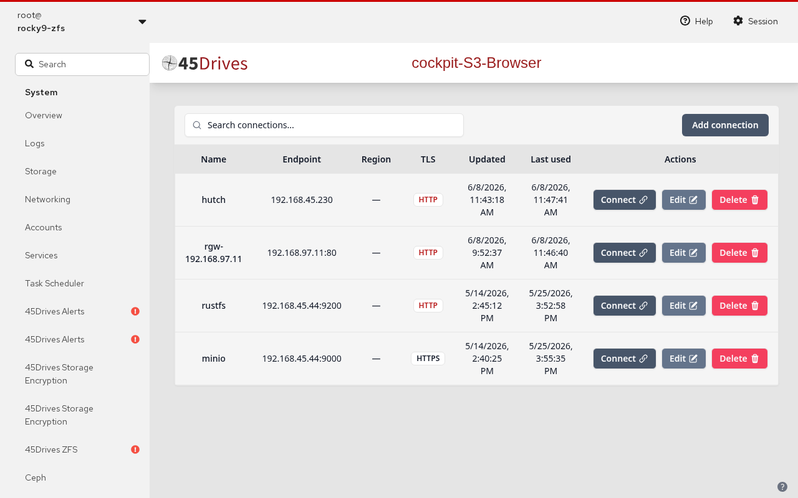
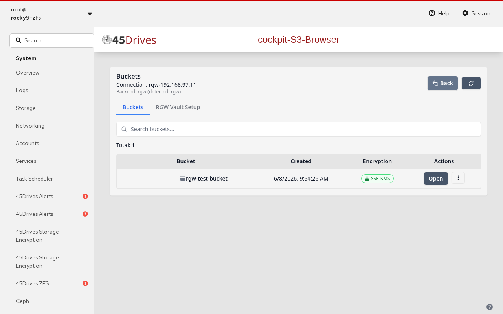
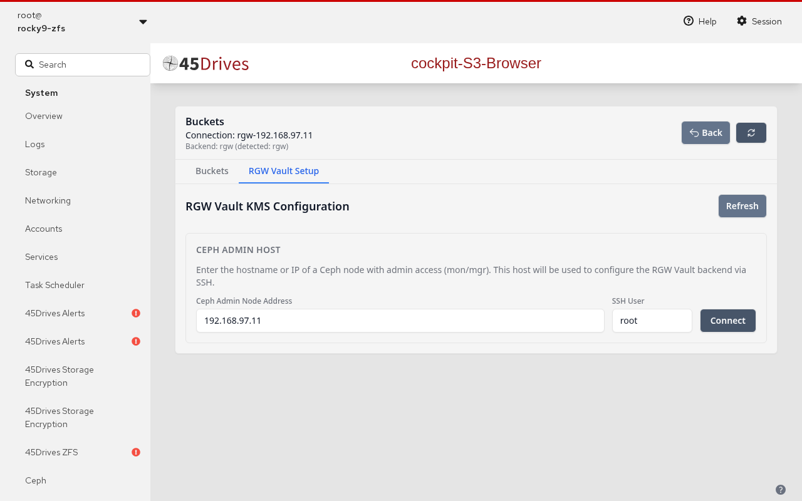
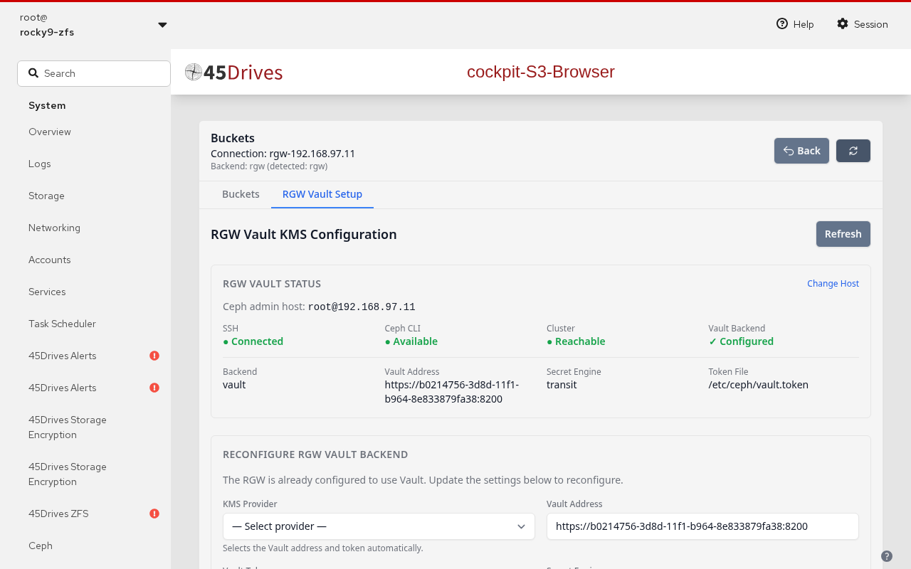
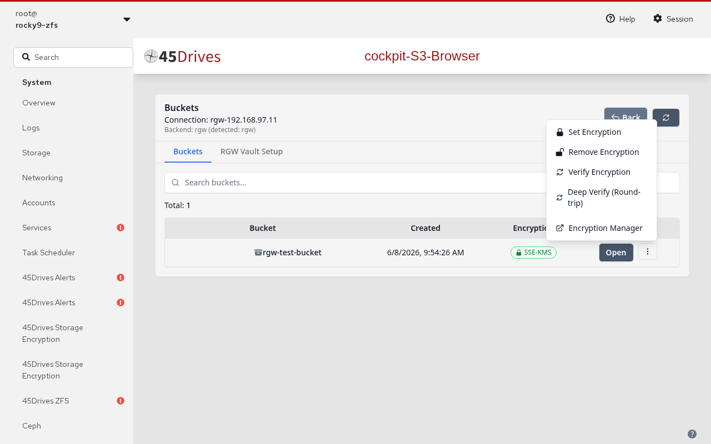
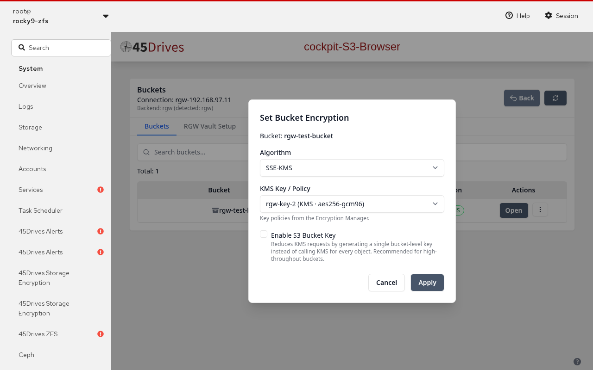
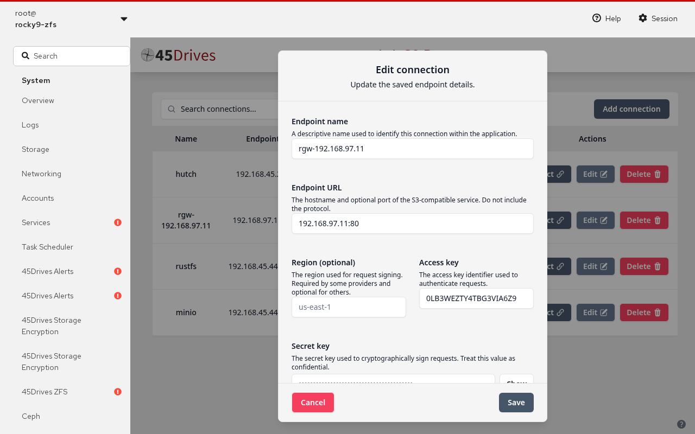
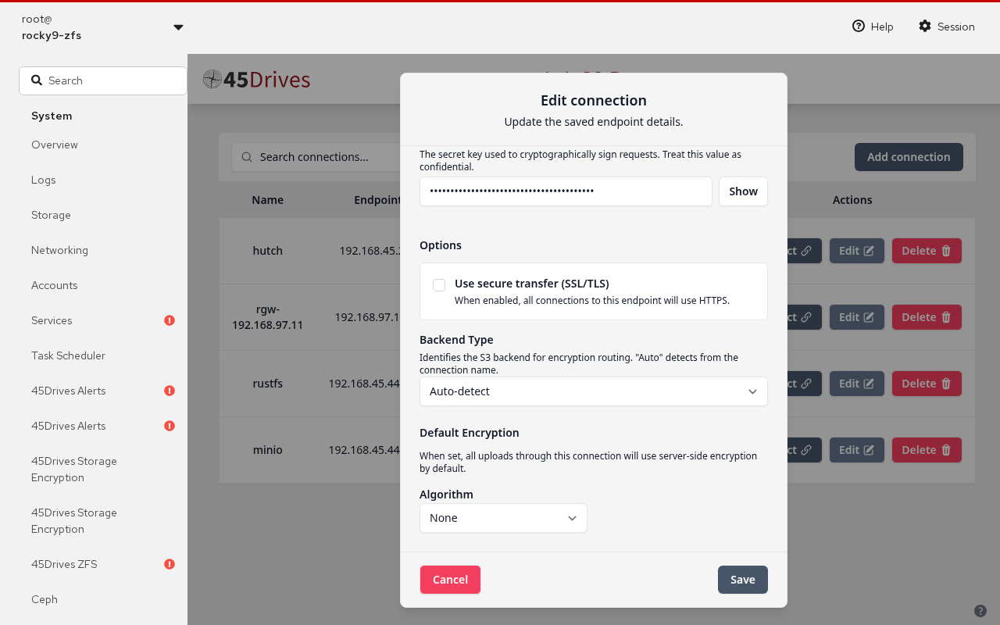

# RGW Encryption Setup & Usage Guide

This guide walks through configuring HashiCorp Vault KMS encryption for Ceph RGW using the Cockpit S3 Browser, and then using encryption for buckets and objects.

> **Video walkthrough**: See [rgw-encryption-guide.mp4](rgw-encryption-guide.mp4) (narrated) or listen to [individual audio segments](audio/).

---

## Table of Contents

1. [Prerequisites](#prerequisites)
2. [Accessing the S3 Browser](#accessing-the-s3-browser)
3. [RGW Vault KMS Configuration](#rgw-vault-kms-configuration)
   - [Step 1: Enter Ceph Admin Host](#step-1-enter-ceph-admin-host)
   - [Step 2: Preflight Checks](#step-2-preflight-checks)
   - [Step 3: Configure Vault Backend](#step-3-configure-vault-backend)
4. [Setting Bucket-Level Encryption](#setting-bucket-level-encryption)
5. [Setting Connection-Level Default Encryption](#setting-connection-level-default-encryption)
6. [Viewing Encryption Status](#viewing-encryption-status)
7. [Verifying Encryption](#verifying-encryption)

---

## Prerequisites

- Cockpit installed with the S3 Browser plugin
- A Ceph cluster with RGW deployed
- HashiCorp Vault server with the Transit secrets engine enabled
- SSH access from the Cockpit host to a Ceph admin node (mon/mgr)
- (Optional) 45Drives Encryption Manager installed for key policy management

---

## Accessing the S3 Browser

1. Open your browser and navigate to `https://<cockpit-host>:9090`.
2. Log in with your system credentials.
3. From the Cockpit dashboard, navigate to the **S3 Browser** in the left sidebar.
4. You'll see your saved endpoint connections.

   

5. Click on an RGW connection to open the Buckets view.

   

---

## RGW Vault KMS Configuration

The RGW Vault Setup wizard configures your Ceph RGW daemon to use HashiCorp Vault's Transit engine for SSE-KMS encryption.

Click the **RGW Vault Setup** tab in the navigation bar above the buckets list.

---

### Step 1: Enter Ceph Admin Host

The first screen asks for the address of a Ceph node with admin access. This node will be used to run `ceph config set` commands via SSH.

1. Enter the **Ceph Admin Node Address** (IP or hostname of a mon/mgr node).
2. Set the **SSH User** (defaults to `root`).
3. Click **Connect**.

> **Note**: If passwordless SSH is not configured, the wizard will prompt you to deploy an SSH key by entering the password for the remote host.

---

### Step 2: Preflight Checks

After connecting, the system runs automated preflight checks:

The status panel shows four indicators:

| Check | Description |
|-------|-------------|
| **SSH** | Connectivity to the Ceph admin host |
| **Ceph CLI** | Whether `ceph` command is available on the remote host |
| **Cluster** | Whether the Ceph cluster is reachable |
| **Vault Backend** | Whether RGW is already configured with a Vault backend |

- **Green (●)** = passed
- **Yellow (○)** = warning (non-critical)
- **Red (✗)** = failed (critical — must be resolved)

If all critical checks pass, the configuration form appears below.

If the **Vault Backend** shows "✓ Configured", you'll also see the current configuration details (backend type, Vault address, secret engine, and token file path).

---

### Step 3: Configure Vault Backend

Once preflight checks pass, the configuration form allows you to set up (or reconfigure) the Vault backend:

Fill in the following fields:

| Field | Description |
|-------|-------------|
| **KMS Provider** | Select a provider from the Encryption Manager dropdown (auto-fills Vault address and token) |
| **Vault Address** | The URL of your Vault server (e.g., `https://10.20.0.142:8200`). Auto-filled if a provider is selected. |
| **Vault Token** | A token with access to the Transit secrets engine. Leave blank when using a provider to auto-generate a scoped token. |
| **Secret Engine** | The Vault secrets engine to use (default: `transit`) |
| **Vault Namespace** | Optional. Leave empty for the root namespace. |

Click **Configure Vault Backend** (or **Update Vault Configuration** if reconfiguring).

The result panel will show:
- ✓/✗ status for each `ceph config set` parameter applied
- Whether the RGW daemon was successfully redeployed
- Any manual steps required (e.g., `ceph orch redeploy rgw.<service_id>`)

---

## Setting Bucket-Level Encryption

Bucket-level encryption ensures every new object written to a bucket is encrypted by default.

1. In the **Buckets** view, click the **⋮** (three-dot menu) for the target bucket.

   

2. Click **Set Encryption**.

3. In the modal that appears:

   

   - **Algorithm**: Choose **AES-256 (SSE-S3)** or **SSE-KMS**
   - **KMS Key / Policy** (SSE-KMS only): Select a key policy from the Encryption Manager dropdown, or enter a KMS key ID manually
   - **Enable S3 Bucket Key** (SSE-KMS only): Check this to reduce KMS API calls by generating a bucket-level data key (recommended for high-throughput buckets)

4. Click **Apply**.

The bucket's encryption column will update to show a green lock badge with the algorithm.

### Remove Encryption

1. Click the **⋮** menu → **Remove Encryption**
2. Confirm in the dialog

> **Important**: Existing encrypted objects remain encrypted. Only new objects will no longer be automatically encrypted.

---

## Setting Connection-Level Default Encryption

Connection-level encryption provides a fallback default for all uploads when no bucket-level encryption is configured.

1. Edit an existing connection (or create a new one).

   

2. Scroll to the **Default Encryption** section.

   

3. Under **Algorithm**, choose:
   - **None** — no default encryption
   - **SSE-S3 (AES256)** — S3-managed encryption
   - **SSE-KMS** — KMS-managed encryption

4. If you selected **SSE-KMS**, select a KMS key policy from the dropdown or enter a key ID manually.

5. Click **Save**.

---

## Viewing Encryption Status

### Bucket List

The Buckets view shows an **Encryption** column:
- **🔒 AES256** or **🔒 aws:kms** (green) — bucket has default encryption
- **🔓 None** (gray) — no default encryption

### Object Details Panel

Select any object and open the Details side panel. The **Encryption** section shows:
- **Algorithm** — `AES256` or `aws:kms`
- **KMS Key ID** — the key used (SSE-KMS only)
- **Bucket Key** — Enabled/Disabled

---

## Verifying Encryption

When the Encryption Manager is installed, additional verification actions appear in the bucket **⋮** menu:

| Action | Description |
|--------|-------------|
| **Verify Encryption** | Checks that the bucket's encryption config is correctly applied and readable |
| **Deep Verify (Round-trip)** | SSE-KMS only. Writes a test object → reads metadata → downloads → deletes. Confirms the KMS key is accessible and encryption/decryption works end-to-end. |

---

## Encryption Priority Order

When determining which encryption to apply, the system uses this priority:

1. **Bucket encryption config** — highest priority
2. **Connection default encryption** — fallback if bucket has none
3. **No encryption** — if neither is configured

---

## Troubleshooting

| Issue | Solution |
|-------|----------|
| SSH check fails | Deploy SSH key via the wizard, or manually run `ssh-copy-id root@<ceph-host>` |
| Vault Backend shows "Not set" | Complete the Configure Vault Backend form |
| RGW daemon not picking up changes | Manually redeploy: `ceph orch redeploy rgw.<service_id>` |
| KMS key dropdown is empty | Ensure the Encryption Manager is installed and has Transit key policies configured |
| Deep Verify fails | Check that the Vault token has read/write access to the Transit engine and the key exists |
